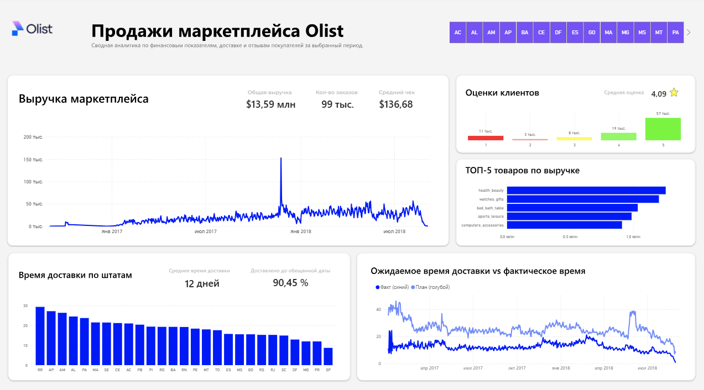

# Анализ эффективности продаж и логистики маркетплейса Olist

### Код: [SQL Scripts](sql/analysis.sql)

### Цель: 
Создать единую систему аналитики для мониторинга KPI и определить ключевые факторы, влияющие на удовлетворенность клиентов.

### Описание проекта: 
Проект сфокусирован на анализе реального набора данных бразильского маркетплейса, содержащего 100k+ заказов за 2016–2018 годы. Данные включали 9 таблиц: заказы, товары, отзывы, геолокацию, платежи и статусы доставки.
Работа включала развертывание базы данных PostgreSQL, сложную очистку "грязных" данных (ETL) с использованием SQL, проектирование модели данных «Star Schema» и разработку интерактивного дашборда в Power BI с кастомным дизайном из Figma.

## Навыки:
ETL pipelines, data cleaning, data modeling (Star Schema), DAX measures, UI/UX prototyping, root cause analysis, business storytelling.

### Технологии:
PostgreSQL, Power BI, Figma, Excel, DBeaver.

### Результаты:
Анализ выявил прямую зависимость между задержкой доставки и падением рейтинга (SLA доставки — критический фактор). Установлено, что среднее время доставки составляет 12.5 дней, а 90.45% заказов приходят вовремя. Выявлены проблемные регионы (Северные штаты), требующие смены логистического партнера.

### Источник данных: [Brazilian E-Commerce Public Dataset by Olist](https://www.kaggle.com/datasets/olistbr/brazilian-ecommerce)

---
*Автор: Анатолий Коношонок*
*https://www.linkedin.com/in/anatolykonoshonok/*